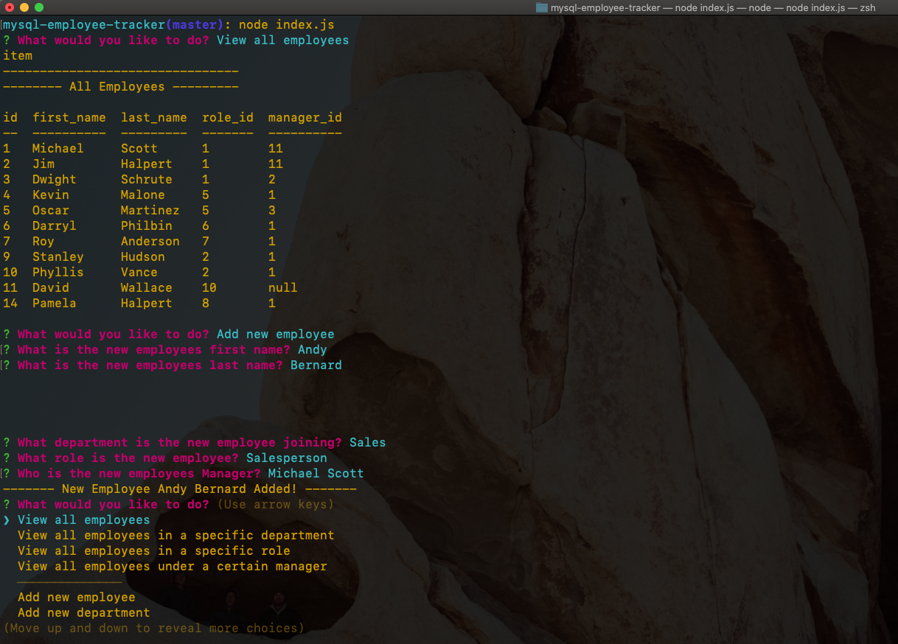
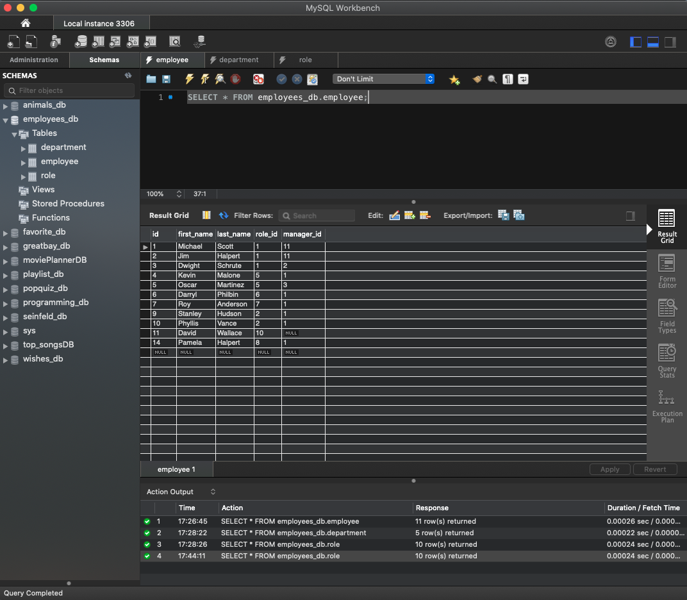

# A Command Line Employee Management System
A command line employee management system, built using Node, Inquirer, and MySQL.

## Links
* [Video of Application in Action](https://drive.google.com/file/d/1gWsmbKOK7raBtA9TISHZaCcK0rvKHwMq/view)

## Application in Action

* An example of the command line interface.

* The MySQL Database.

## Technologies Used
* Javascript
* Node.js
* MySQL
* Node modules: Inquirer, dotenv, console.table, mysql

## Usage
* Run 'node index.s' from the command line

## Questions

If you have any questions about the project, contact me at grantnsmith@gmail.com
